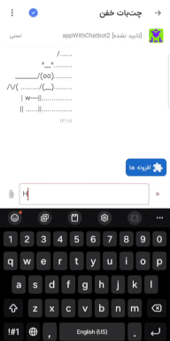

# 🐮 Divar Cowsay Bot 

A fun and quirky chatbot implementation in [Divar](https://divar.ir)'s chat environment
using divar openapi that transforms your messages into ASCII cow art!
  
**Built using the** [KenarBot SDK](https://github.com/Mobin-Pourabedini/KenarBot). ⚙️
  
Powered By [Kenar Divar](https://divar.ir/kenar) 🚀
## 🎬 Demo & Showcase

### 🎯 See it in action!
Let the cow speak for itself! 🐄:

### 🌟 Try these examples:
- Send "Hello World!" 
- Try Persian text like "سلامممم دنیا"
- Use emojis and special characters

## ✨ Features

- 🎨 Transforms any message into a cow saying it in ASCII art
- 📝 RTL compatibility for Persian text
- 📱 Optimized display across different clients (web and mobile)

## 🔧 Technical Details

### 🛠️ Built With

- 🐍 Python 3.9
- 🤖 [KenarBot SDK](https://github.com/Mobin-Pourabedini/KenarBot) - Custom SDK for Divar's chat platform
- 🎨 [cowsay](https://pypi.org/project/cowsay/) - For generating ASCII art
- 🚀 Gunicorn - WSGI HTTP Server
- 🐳 Docker

### 💡 Implementation Highlights

The bot uses several text manipulation techniques to ensure proper display in Divar's RTL environment:

- 📝 Space preservation using temporary characters
- ⚡ RTL markers insertion for consistent display
- 🔄 Forward/backward slash swapping for RTL compatibility
- ✨ Font ratio adjustments for Divar's chat interface

### 🚀 Deployment

The application is containerized using Docker and uses Gunicorn as the WSGI HTTP server. Gunicorn provides:

- 📊 Process management
- 🔄 Multiple worker processes for handling concurrent requests
- ⚡ Better performance and reliability compared to development servers
- 📈 Easy scaling capabilities

## 🔐 Environment Variables

- `DIVAR_API_KEY`: Your API key from Kenar platform
- `DIVAR_IDENTIFICATION_KEY`: Your identification key from Kenar platform

## 📄 License

This project is licensed under the MIT License - see the [LICENSE](LICENSE) file for details.

## 🙏 Acknowledgments

- 🚀 Thanks to [Divar](https://divar.ir) for providing the chat platform
- 🧩 Thanks to [Kenar Divar](https://divar.ir/kenar) for their amazing platform
- 🤖 [KenarBot SDK](https://github.com/Mobin-Pourabedini/KenarBot) for making the integration possible

## ⭐ Show your support

Give a ⭐️ if you liked it 😁!